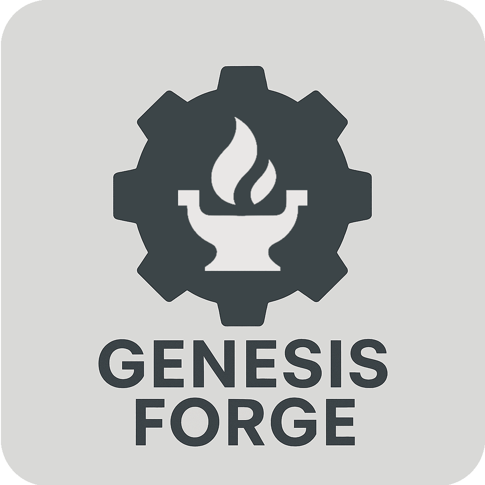

<p align="center">

</p>

# Genesis Forge

A robotics RL training frameworks for Genesis inspired by Isaac Lab and Gymnasium.
The goal of Genesis Forge is to give developers the tools they need to get training quickly, with less of the boilerplate setup.

Features:

- 🦿 Action manager - Control your joints and actuators
- 🏆 Reward/Termination managers - Simple reward and termination setup with automatic logging
- ↪️ Command manager - Generate random direction commands with debug visualizations
- 🏔️ Terrain manager - Randomize locations and curriculum-based placement
- 💥 Contact manager - Create rewards/terminations based on what your robot touches.
- 🎬 Video Wrapper - Automatically records videos at regular intervals during training
- 🕹️ Gamepad interface - Control trained policies directly with a physical gamepad controller.
- And more...

## Example

This is literally all it takes to teach a Go2 robot how to follow direction commands. Explore this and other examples [here](./examples/go2/simple/).

```python
class Go2CEnv(ManagedEnvironment):
    def __init__(
        self,
        num_envs: int = 1,
        dt: float = 1 / 50,
        max_episode_length_s: int | None = 20,
        headless: bool = True,
    ):
        super().__init__(
            num_envs=num_envs,
            dt=dt,
            max_episode_length_sec=max_episode_length_s,
            headless=headless,
        )

        # Construct the scene
        self.scene = gs.Scene(
            show_viewer=not self.headless,
            sim_options=gs.options.SimOptions(dt=self.dt, substeps=2),
        )
        self.scene.add_entity(gs.morphs.Plane())
        self.robot = self.scene.add_entity(
            gs.morphs.URDF(
                file="urdf/go2/urdf/go2.urdf",
                pos=INITIAL_BODY_POSITION,
                quat=INITIAL_QUAT,
            ),
        )

    def config(self):
        # Robot manager - Reset the robot's initial position on reset
        self.robot_manager = EntityManager(
            self,
            entity_attr="robot",
            on_reset={
                "position": {
                    "fn": reset.position,
                    "params": {
                        "position": INITIAL_BODY_POSITION,
                        "quat": INITIAL_QUAT,
                    },
                },
            },
        )

        # Joint Actions
        self.action_manager = PositionActionManager(
            self,
            joint_names=[".*"],
            default_pos={
                ".*_hip_joint": 0.0,
                "FL_thigh_joint": 0.8,
                "FR_thigh_joint": 0.8,
                "RL_thigh_joint": 1.0,
                "RR_thigh_joint": 1.0,
                ".*_calf_joint": -1.5,
            },
            scale=0.25,
            use_default_offset=True,
            pd_kp=20,
            pd_kv=0.5,
        )

        # Commanded direction
        self.velocity_command = VelocityCommandManager(
            self,
            range={
                "lin_vel_x": [-1.0, 1.0],
                "lin_vel_y": [-1.0, 1.0],
                "ang_vel_z": [-1.0, 1.0],
            },
        )

        # Rewards
        RewardManager(
            self,
            logging_enabled=True,
            cfg={
                "base_height_target": {
                    "weight": -50.0,
                    "fn": rewards.base_height,
                    "params": {
                        "target_height": 0.3,
                    },
                },
                "tracking_lin_vel": {
                    "weight": 1.0,
                    "fn": rewards.command_tracking_lin_vel,
                    "params": {
                        "vel_cmd_manager": self.velocity_command,
                    },
                },
                "tracking_ang_vel": {
                    "weight": 1.0,
                    "fn": rewards.command_tracking_ang_vel,
                    "params": {
                        "vel_cmd_manager": self.velocity_command,
                    },
                },
                "lin_vel_z": {
                    "weight": -1.0,
                    "fn": rewards.lin_vel_z,
                },
            },
        )

        # Termination conditions
        self.termination_manager = TerminationManager(
            self,
            logging_enabled=True,
            term_cfg={
                # The episode ended
                "timeout": {
                    "fn": terminations.timeout,
                    "time_out": True,
                },
                # Terminate if the robot's pitch and yaw angles are too large
                "fall_over": {
                    "fn": terminations.bad_orientation,
                    "params": {
                        "limit_angle": 0.174,  # ~10 degrees
                    },
                },
            },
        )

        # Observations
        ObservationManager(
            self,
            cfg={
                "velocity_cmd": {"fn": self.velocity_command.observation},
                "angle_velocity": {
                    "fn": lambda env: self.robot_manager.get_angular_velocity(),
                },
                "linear_velocity": {
                    "fn": lambda env: self.robot_manager.get_linear_velocity(),
                },
                "projected_gravity": {
                    "fn": lambda env: self.robot_manager.get_projected_gravity(),
                },
                "dof_position": {
                    "fn": lambda env: self.action_manager.get_dofs_position(),
                },
                "dof_velocity": {
                    "fn": lambda env: self.action_manager.get_dofs_velocity(),
                    "scale": 0.05,
                },
                "actions": {
                    "fn": lambda env: self.action_manager.get_actions(),
                },
            },
        )
```

## Citation

If you used Genesis Forge in your research, we would appreciate it if you could cite it.

```
@misc{Genesis,
  author = {Jeremy Gillick},
  title = {Genesis Forge: A modular framework for RL robot environments},
  month = {September},
  year = {2025},
  url = {https://github.com/jgillick/genesis-forge}
}
```
