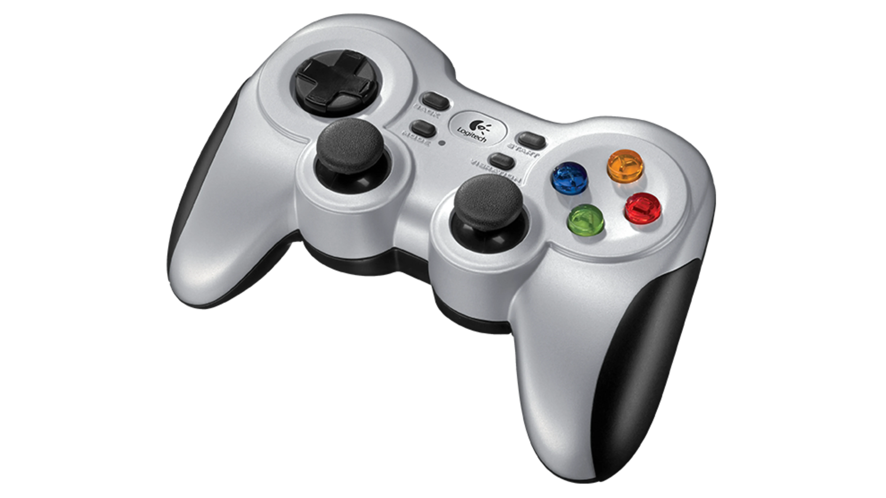

# 🎮 Gamepad Controllers

<video autoplay="" muted="" loop="" playsinline="" controls="" src="../media/gamepad.webm"></video>

Genesis Forge integrates with game controllers through SDL2, supporting a wide range of controllers including Xbox, PlayStation, Nintendo Switch Pro, and many others.

<figure markdown="span">
  { width="350" }
  <figcaption>Game controllers (like the Logitech F710) work seamlessly with Genesis Forge</figcaption>
</figure>

# Installation

Genesis Forge uses SDL2 for gamepad support. The required dependencies (`pysdl2` and `pysdl2-dll`) are automatically installed with genesis-forge. No additional system-level installation is required in most cases.

## Linux (Optional)

On Linux, you may want to ensure your user has permission to access gamepad devices. Most modern distributions handle this automatically, but if you encounter issues, you may need to add udev rules:

```bash
sudo usermod -a -G input $USER
```

Then log out and back in for the changes to take effect.

## Usage

If you have one or more [command managers](managers/command.md) defined in your environment, you can easily connect the gamepad to them in your eval program.

For example, let's say you have both a velocity command and a target height command defined in your environment:

```python title="environment.py"

self.velocity_command = VelocityCommandManager(
    self,
    range={
        "lin_vel_x": [-1.0, 1.0],
        "lin_vel_y": [-1.0, 1.0],
        "ang_vel_z": [-1.0, 1.0],
    },
)
self.height_command = CommandManager(self, range=(0.2, 0.4))
```

Now let's create an eval script that uses the gamepad controller to set these values:

```python title="eval.py"

from genesis_forge.gamepads import Gamepad

# This is where the trained policy was saved
EXPERIMENT_DIR = "./logs/experiment"
TRAINED_MODEL = f"{EXPERIMENT_DIR}/model_100.pt"
[cfg] = pickle.load(open(f"{EXPERIMENT_DIR}/cfgs.pkl", "rb"))

# Initialize the genesis simulator
gs.init(logging_level="warning", backend=gs.gpu)

# Setup the environment
env = MyEnv(num_envs=1, headless=False)
env.build()

# Connect the gamepad
gamepad = Gamepad()
env.velocity_command.use_gamepad(
    gamepad, lin_vel_y_axis=0, lin_vel_x_axis=1, ang_vel_z_axis=2
)
env.height_command.use_gamepad(gamepad, range_axis=3)

# Setup policy runner
env = RslRlWrapper(env)
runner = OnPolicyRunner(env, cfg, EXPERIMENT_DIR, device=gs.device)
runner.load(TRAINED_MODEL)
policy = runner.get_inference_policy(device=gs.device)

obs, _ = env.reset()
with torch.no_grad():
    while True:
        actions = policy(obs)
        obs, _rews, _dones, _infos = env.step(actions)
```

This maps joystick axis 0 and 1 (left joystick) to the robot's Y and X movements, and axis 2 and 3 (right joystick) to rotation and height.

## Supported Controllers

SDL2 provides built-in support for a wide variety of game controllers:
- Xbox controllers (360, One, Series X/S)
- PlayStation controllers (DualShock 3, 4, DualSense)
- Nintendo Switch Pro Controller
- Logitech gamepads (F310, F710, etc.)
- Many other USB and Bluetooth controllers

Controllers are automatically detected and mapped when connected.
