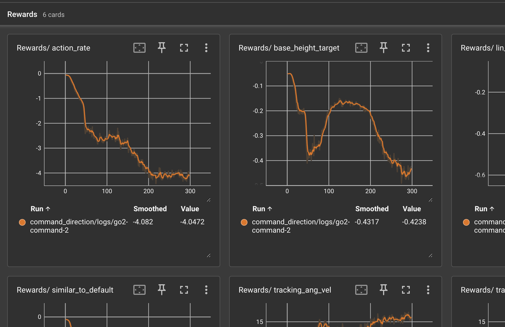

# Reward Manager

The Reward Manager handles computing, combining, and logging reward components in your RL environment. It provides a clean way to define multi-objective rewards with automatic tracking and tensorboard logging.

You can see a full example using the reward manager in [examples/basic](https://github.com/jgillick/genesis-forge/tree/main/examples/basic).

## Overview

The Reward Manager allows you to:

- Define multiple reward components with individual weights
- Automatically sum rewards and track individual contributions
- Log rewards to tensorboard for analysis
- Dynamically adjust rewards during training (curriculum learning)
- Reuse common reward functions from the MDP library

## Basic Usage

```python
from genesis_forge.managers import RewardManager
from genesis_forge.mdp import rewards

class MyEnv(ManagedEnvironment):
    def config(self):
        RewardManager(
            self,
            cfg={
                "height": {
                    "weight": -1.0,
                    "fn": rewards.base_height(target_height=0.3),
                },
                "flat_orientation": {
                    "fn": rewards.flat_orientation_l2(),
                    "weight": -1.0,
                },
            },
        )
```

## Reward Configuration

Each reward config item requires:

- **fn**: A function that computes the reward
- **weight**: Multiplier for this component (can be negative for penalties)

```python
RewardManager(
    self,
    cfg={
        "height_tracking": {
            "weight": -10.0,  # Strong penalty for wrong height
            "fn": rewards.base_height(target_height=0.35),
        },
    },
)
```

A plain function paired with a **params** dict also works, and is how custom reward
functions that take no state cam be written:

```python
def my_reward(env, target_height=0.3):
    ...

RewardManager(
    self,
    cfg={
        "custom": {
            "weight": -1.0,
            "fn": my_reward,
            "params": {"target_height": 0.35},
        },
    },
)
```

## Built-in Reward Functions

Genesis Forge provides many common reward functions in [`genesis_forge.mdp.rewards`](../../api/mdp/rewards.md):

## Custom Reward Functions

A custom reward function is defined as a simple dataclass with a `__call__` method that executes the reward calculation. The returned value should be a tensor (shape: `(num_envs,)`) with a `float` value for each environment.

```python
@dataclass(kw_only=True, eq=False)
class target_height_reward(MdpFn):
    """Reward for reaching a target height."""
    target_height: float = 0.3
    def __call__(self, env: GenesisEnv) -> torch.Tensor:
        base_pos = env.robot.get_pos()
        return torch.square(base_pos[:, 2] - self.target_height)
```

```python
RewardManager(
    self,
    cfg={
        "height": {
            "weight": -5.0,
            "fn": target_height_reward(target_height=0.3),
        },
    },
)
```

A simple reward also be defined as a plain function or lambda:

```python
def stay_centered(env):
    """Reward for staying near origin."""
    distance = torch.norm(env.robot.get_pos()[:, :2], dim=1)
    return torch.exp(-distance)
```

```python
RewardManager(
    self,
    cfg={
        "stay_centered": {
            "fn": stay_centered,
            "weight": 0.5,
        },
        # Or as a one-liner lambda:
        "spin_penalty": {
            "fn": lambda env: torch.abs(env.robot.get_ang_vel()[:, 2]),
            "weight": -0.2,
        },
    },
)
```

## More complex reward functions

If your reward needs to do some processing on the parameters, or be stateful in any way, defined the build and/or reset methods.

```python
@dataclass(kw_only=True, eq=False)
class survival_bonus(MdpFn):
    """Reward that grows the longer the robot has stayed alive this episode."""

    growth_rate: float = 0.01

    def build(self):
        self._alive_steps = torch.zeros(self.env.num_envs, device=gs.device)

    def reset(self, envs_idx):
        """Restart the count for episodes that just ended."""
        self._alive_steps[envs_idx] = 0.0

    def __call__(self, env: GenesisEnv) -> torch.Tensor:
        self._alive_steps += 1
        return self._alive_steps * self.growth_rate
```

```python
RewardManager(
    self,
    cfg={
        "survive_longer": {
            "weight": 1.0,
            "fn": survival_bonus(growth_rate=0.01),
        },
    },
)
```

## Dynamic Reward Adjustment

### Curriculum Learning

Adjust rewards based on training progress. Both the **weight** of a reward and the
**params** of the reward function can be changed mid-training:

```python
class MyEnv(ManagedEnvironment):
    def config(self):
        self.reward_manager = RewardManager(self, cfg={
            "forward_vel": {
                "weight": 1.0,
                "fn": ...,
            },
            "upright": {
                "weight": -1.5,
                "fn": ...,
            },
            "height": {
                "weight": -50.0,
                "fn": rewards.base_height(target_height=0.3),
            },
        })

    def step(self, actions):
        self.update_curriculum()
        return super().step(actions)

    def update_curriculum(self):
        """Called periodically during training."""
        if self.step_count == 200:
            # Mid training: increase speed focus
            self.reward_manager.cfg["upright"].weight = -2.0
            self.reward_manager.cfg["forward_vel"].weight = 2.0
        elif self.step_count == 500:
            # Late training: ask the robot to stand taller
            self.reward_manager.cfg["height"].fn.target_height = 0.35
```

Assigning a param on the function re-runs its `build()`, so anything derived from that
param is recomputed. Changing several params at once should go through `update()` so the
function is rebuilt once rather than once per assignment:

```python
self.reward_manager.cfg["height"].fn.update(target_height=0.35, entity_attr="robot")
```

`increment_param()` is a convenience for nudging a numeric param, with an optional limit:

```python
# Raise the target height by 0.01 each time, stopping at 0.4
self.reward_manager.cfg["height"].increment_param("target_height", 0.01, limit=0.4)
```

## Logging and Analysis

By default, individual reward components are logged to the `episode` item in the extras/infos dict. For many RL frameworks, like rsl_rl and skrl, items there will automatically be logged to tensorboard, or simular system. Rewards will be placed under the "Rewards" section.

<figure markdown="span">
  
  <figcaption>Example tensorboard reward logging</figcaption>
</figure>

To disable logging, set `logging_enabled` to `False`. To change the extras dict key that reward items are logged to, set the `extras_logging_key` param on the [environment](../../api/environments/genesis.md).
