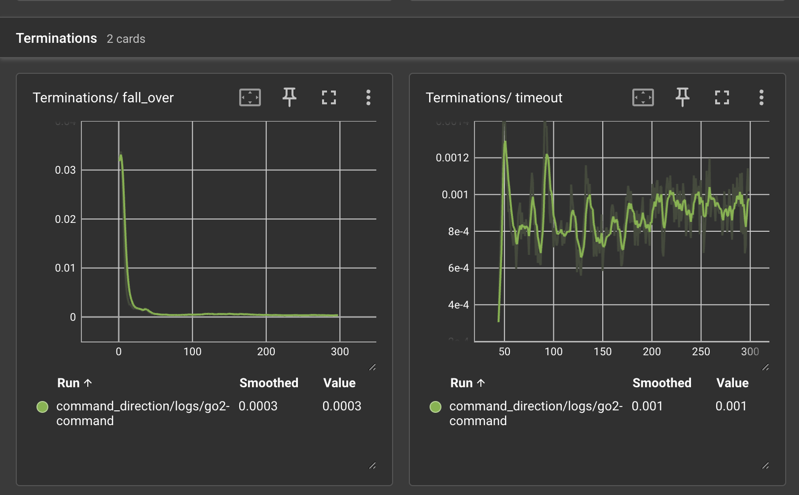

# Termination Manager

The Termination Manager handles episode termination conditions in your RL environment. It determines when episodes should end, distinguishes between timeouts and failures, and provides automatic logging of termination reasons.

You can see a full example using the termination manager in [examples/rough_terrain](https://github.com/jgillick/genesis-forge/tree/main/examples/rough_terrain).

## Basic Usage

```python
from genesis_forge.managers import TerminationManager
from genesis_forge.mdp import terminations

class MyEnv(ManagedEnvironment):
    def config(self):
        self.termination_manager = TerminationManager(
            self,
            logging_enabled=True,
            term_cfg={
                "timeout": {
                    "fn": terminations.timeout(), # Ends the episode when it reaches the maximum steps (env.max_episode_length)
                    "time_out": True,  # This is a timeout, not failure
                },
                "fall_over": {
                    # Terminate if the robot is falling over
                    "fn": terminations.bad_orientation(limit_angle=28.0),  # degrees
                },
            },
        )
```

## Termination Configuration

Each termination condition has:

- **fn**: Function that returns boolean tensor indicating termination, constructed with its params
- **time_out**: Whether this is a timeout (`True`) or failure (`False`, default)

```python
TerminationManager(
    self,
    term_cfg={
        "max_episode_length": {
            "fn": terminations.timeout(),
            "time_out": True,  # Normal episode end
        },
        "robot_fell": {
            "fn": terminations.bad_orientation(limit_angle=0.3),
        },
        "out_of_bounds": {
            "fn": lambda env: torch.norm(env.robot.get_pos()[:, :2], dim=1) > 5.0,
        },
    },
)
```

## Built-in Termination Functions

Genesis Forge provides common termination conditions in [`genesis_forge.mdp.terminations`](../../api/mdp/terminations.md):

```python
term_cfg={
    "too_low": {
        "fn": terminations.base_height_below_minimum(minimum_height=0.05),
    },
}
```

### Actuator limits

Terminate when commanded torque or joint speed exceed safe limits:

```python
term_cfg={
  # Uses max_force from the actuator manager when threshold is omitted
  "dof_overforce": {
    "fn": terminations.dof_control_force_limit(
        actuator_manager=self.actuator_manager,
    ),
  },
  # Or pass an explicit limit below the actuator clip
  "dof_overforce_strict": {
      "fn": terminations.dof_control_force_limit(
          actuator_manager=self.actuator_manager,
          threshold=18.0,
      ),
  },

  # Actuator is moving too fast
  "dof_overspeed": {
      "fn": terminations.dof_velocity_limit(
          actuator_manager=self.actuator_manager,
          threshold=300.0,
          unit="rpm",
      ),
  },
}
```

## Custom Termination Functions

A custom termination function is defined as a simple dataclass with a `__call__` method that executes the check. The returned value should be a tensor (shape: `(num_envs,)`) with a `bool` value for each environment.

```python
@dataclass(kw_only=True, eq=False)
class velocity_limit(MdpFn):
    """Terminate if robot moves too fast."""

    max_velocity: float = 10.0

    def __call__(self, env: GenesisEnv) -> torch.Tensor:
        velocity = torch.norm(env.robot.get_vel(), dim=1)
        return velocity > self.max_velocity

TerminationManager(
    self,
    term_cfg={
        "too_fast": {
            "fn": velocity_limit(max_velocity=8.0),
        },
    },
)
```

A termination with no params can stay a plain function or lambda, as shown in the `out_of_bounds` example above.

## Timeout vs Termination

Understanding the distinction is important for RL algorithms:

- **Timeout** (`time_out=True`): Natural episode end, not a failure
  - Episode reached max length
  - Task successfully completed
  - Training scenario ended

- **Termination** (`time_out=False`): Episode ended due to failure
  - Robot fell over
  - Violated safety constraints
  - Task failed

## Curriculum-Based Termination

Adjust termination criteria during training:

```python
class MyEnv(ManagedEnvironment):
    def config(self):
        self.termination_manager = TerminationManager(self, term_cfg={
            "timeout": {
                "fn": terminations.timeout(),
                "time_out": True,
            },
            "bad_orientation": {
                "fn": terminations.bad_orientation(limit_angle=25),
            },
            "too_low": {
                "fn": terminations.base_height_below_minimum(minimum_height=0.05),
            }
        })

    def step(self, actions):
        self.update_curriculum()
        return super().step(actions)

    def update_curriculum(self):
        """Make termination criteria stricter over time."""
        if self.step_count > 200:
            # Mid: moderate
            limit_angle = 20
            height_threshold = 0.10
        else:
            # Late: strict
            limit_angle = 17
            height_threshold = 0.15

        # Update termination parameters
        self.termination_manager.term_cfg["bad_orientation"].fn.limit_angle = limit_angle
        self.termination_manager.term_cfg["too_low"].fn.minimum_height = height_threshold
```

## Logging and Analysis

By default, individual termination averages are logged to the `episode` item in the extras/infos dict. For many RL frameworks, like rsl_rl and skrl, items there will automatically be logged to tensorboard, or simular system. Terminations will be placed under the "Terminations" section.

<figure markdown="span">
  
  <figcaption>Example tensorboard termination logging</figcaption>
</figure>

To disable logging, set `logging_enabled` to `False`. To change the extras dict key that termination items are logged to, set the `extras_logging_key` param on the [environment](../../api/environments/genesis.md).
