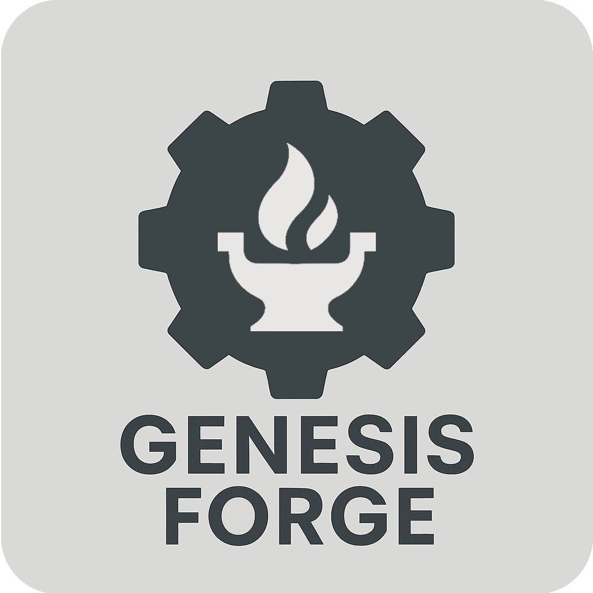

# Genesis Forge



<br />

Genesis Forge is a powerful robotics reinforcement learning framework using the [Genesis](https://genesis-world.readthedocs.io/en/latest/) physics simulator. It provides a flexible and modular architecture to get your robot up and running quickly with less boilerplate work.

## RL Robotics, What?

Today, modern robots learn to balance, walk, manipulate objects, and more, using AI/[Reinforcement Learning](https://huggingface.co/learn/deep-rl-course/en/unit1/what-is-rl) algorithms. You simply create a program that defines a task and provides feedback on the robot's performance — much like training a dog with treats and commands. Genesis Forge is a framework that makes this very easy to, with [documentation](https://genesis-forge.readthedocs.io/en/latest/guide/index.html) and [examples](https://github.com/jgillick/genesis-forge/tree/main/examples) to get you started.

## Key Features

- ⚙️ Modular composable environment design
- 💥 Comprehensive contact/collision manager
- 🎬 Automatically record video snippets during training
- 🕹️ Connect a game controller for hands-on policy evaluation and play-mode.
- 🤖 Seamless integration with popular RL libraries: [RSL-RL](https://github.com/leggedrobotics/rsl_rl/tree/main) and [SKRL](https://skrl.readthedocs.io/en/latest/)

<video autoplay="" muted="" loop="" playsinline="" controls="" src="media/cmd_locomotion.webm"></video>

## Citation

If you used Genesis Forge in your research, we would appreciate it if you could cite it.

```bibtex
@misc{Genesis-Forge,
  author = {Jeremy Gillick},
  title = {Genesis Forge: A modular framework for RL robot environments},
  month = {September},
  year = {2025},
  url = {https://github.com/jgillick/genesis-forge}
}
```
