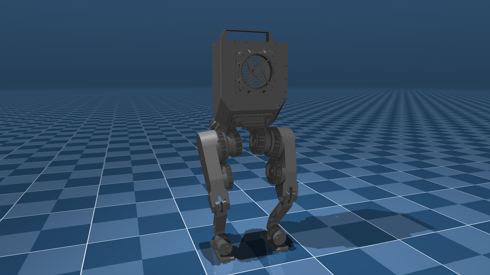

# Berkeley Humanoid Robot

A simple locomotion training environment for the [Berkeley Humanoid Robot](https://berkeley-humanoid.com/) using the model from the [Mujoco Menagerie repository](https://github.com/google-deepmind/mujoco_menagerie/tree/main/berkeley_humanoid)



## Training

### With [uv](https://docs.astral.sh/uv/) (recommended)

Training:

```shell
uv run ./train.py
```

Evaluation:

```shell
uv run ./eval.py
```

### Without uv:

Install dependencies

```shell
pip install -e ../../ "rsl-rl-lib~=5.0" tensorboard torch
```

Train:

```shell
python ./train.py
```

Evaluation:

```shell
python ./eval.py
```
