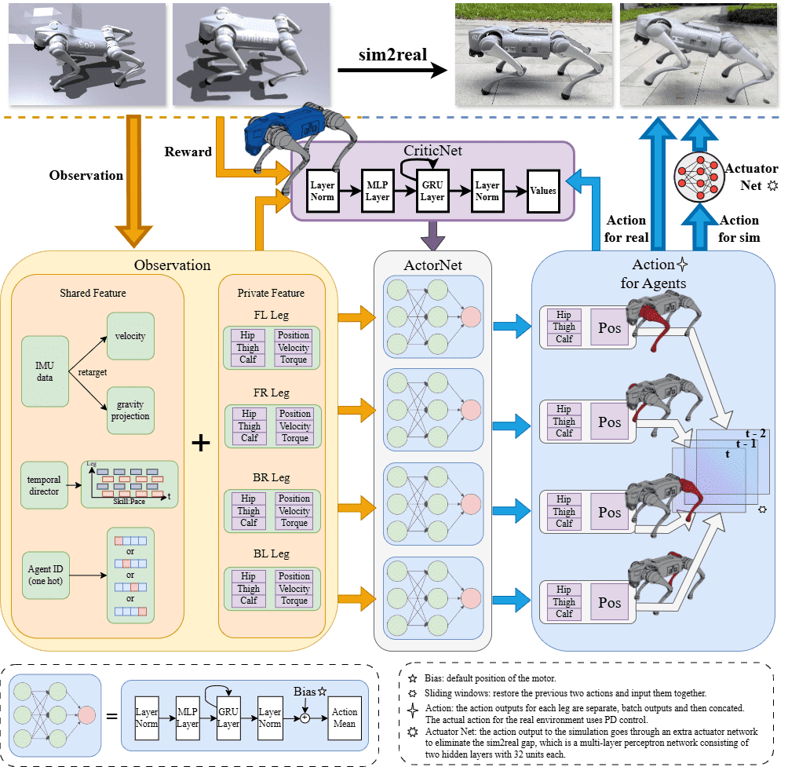

# Multi-Agent Reinforcement Learning (MASQ)

This is a more advanced example that shows how to use **multiple agents** to cooperatively train a single robot. In this case, each leg has its own agent, which learn in parallel to execute a shared task: walking. It is inspired by [**MASQ** — Multi-Agent RL for a single quadruped](https://arxiv.org/abs/2408.13759): many policies, one physical robot, shared team reward.

When done well, "MASQ not only speeds up learning convergence but also enhances robustness in real-world settings".

The physics and rewards follow the same pattern as the [command-direction tutorial](../command_direction/README.md), but scene code, MARL adapters, and training live in this folder.

---

## The big picture



For each environment, the action and observation space are divided among each agent. In this case, we have 4 agents (one for each leg): `FL`, `FR`, `RL`, `RR`.

We define 4 actuator/action controllers, one for each agent/leg:

```python
for agent in self.AGENTS:
  self.leg_actuator_managers[agent] = ActuatorManager(
      self,
      joint_names=[
          f"{agent}_hip_joint",
          f"{agent}_thigh_joint",
          f"{agent}_calf_joint",
      ],
      ...
  )
  self.leg_action_managers[agent] = PositionActionManager(
      self,
      actuator_manager=self.leg_actuator_managers[agent],
      ...
  )
```

For observations, we define a shared observation set -- which all agents will receive -- and an observation set for each agent/leg.

```python
# Shared observations with the overall robot state
ObservationManager(
    self,
    name="shared",
    cfg={
        "velocity_cmd": {"fn": self.velocity_command.observation},
        "angle_velocity": {
            "fn": lambda env: self.robot_manager.get_angular_velocity(),
        },
        ...
    },
)

# Observations for each leg
for agent in self.AGENTS:
    action_manager = self.leg_action_managers[agent]
    ObservationManager(
        self,
        name=agent,
        cfg={
            "dof_position": {
                "fn": lambda env: action_manager.get_dofs_position(),
            },
            ...
        },
    )
```

Finally, the SKRL wrapper defined in [env_wrapper.py](./env_wrapper.py) handles packaging and proxying the actions, observations, rewards, and terminations betweek SKRL and the environment during training.

## Training

### With [uv](https://docs.astral.sh/uv/) (recommended)

Training:

```shell
uv run ./train.py
```

Evaluation:

```shell
uv run ./eval.py
```

### Without uv:

Install dependencies

```shell
pip install -e ../../ skrl[torch] tensorboard torch
```

Train:

```shell
python ./train.py
```

Evaluation:

```shell
python ./eval.py
```
