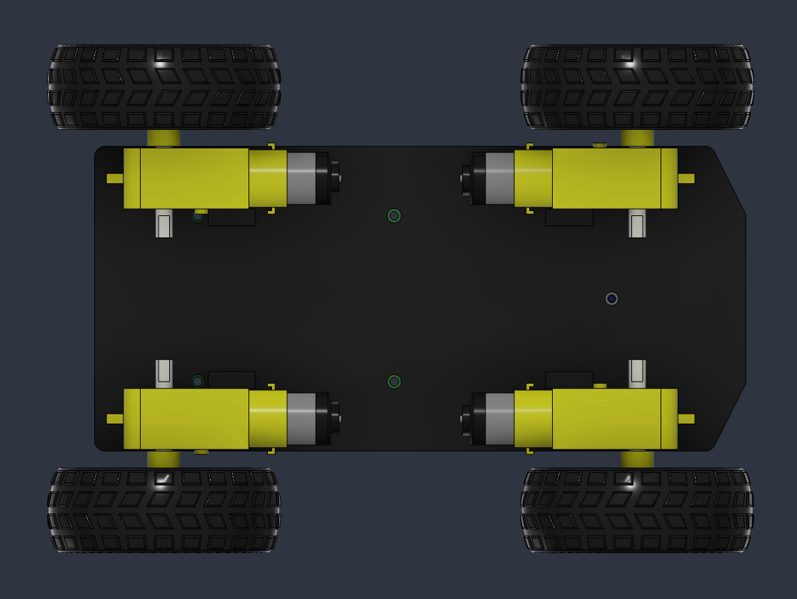

# Wheeled Robot - Commanded direction

Train a simplified [Freenove 4WD car](https://store.freenove.com/products/fnk0043) platform, to move in a commanded direction, controlled programmatically or through a gamepad controller.

This is a ["differential steering"](https://en.wikipedia.org/wiki/Differential_steering) robot, which means, all 4 wheels are facing the same direction and turning is done by changing the speed of the wheels on either side.

## Driving: two actions, not four

The robot has four wheels, in a ["differential steering"](https://en.wikipedia.org/wiki/Differential_steering) configuration, which means, turning is done by changing the speed of the wheels on the left and right side. This also means that the wheels on each side (left or right) act like a synchronized pair, each turning the same speed.

Asking the model to provide four actions for a car that only truly needs two, would be a waste. So we can group the actuators together using action_groups.

```python
self.wheel_action_manager = VelocityActionManager(
    self,
    action_groups=[
        ["TT_Motor-3_axel", "TT_Motor-4_axel"],  # left side
        ["TT_Motor-1_axel", "TT_Motor-2_axel"],  # right side
    ],
    ...
)
```

The other peculiarity is that the front motors are mounted in reverse orientation to the rear motors. So if you applied the same positive velocity to all four motors, the front and rear motors would be moving in opposite directions and the car would move nowhere.



To solve this, we can use negative action scaling to reverse the target actuator actions on the front motors.

```python
self.wheel_action_manager = VelocityActionManager(
    self,
    action_groups=[
        ["TT_Motor-3_axel", "TT_Motor-4_axel"],  # left side
        ["TT_Motor-1_axel", "TT_Motor-2_axel"],  # right side
    ],
    scale={
        "TT_Motor-1_axel": -1,  # right front (reverse action sign)
        "TT_Motor-2_axel": +1,  # right rear
        "TT_Motor-3_axel": -1,  # left front (reverse action sign)
        "TT_Motor-4_axel": +1,  # left rear
    },
    ...
)
```

Now, if the model sends an action of `5` to the left motors, the left/front action will be translated to `-5` and the left/rear action will remain as `+5`.

Lastly, since the robot can only move forwards and backwards, but not side-to-side, the commanded linear velocity range is set to zero.

```python
    self.velocity_command = VelocityCommandManager(
        self,
        range={
            "lin_vel_x": (-0.1, 0.1), # forward/backward
            "lin_vel_y": (-0.0, 0.0), # cannot move side-to-side
            "ang_vel_z": (-0.2, 0.2), # turning
        },
        ...
    )
```

## Training

### With [uv](https://docs.astral.sh/uv/) (recommended)

Training:

```shell
uv run ./train.py
```

Evaluation:

```shell
uv run ./eval.py
```

### Without uv:

Install dependencies

```shell
pip install -e ../../ "rsl-rl-lib~=5.0" tensorboard
```

Train:

```shell
python ./train.py
```

Evaluation:

```shell
python ./eval.py
```

## Monitor training status

You can view the training progress with:

```shell
tensorboard --logdir ./logs/
```

## Training videos

The Genesis Forge training environment will save videos while training that can be viewed in `./logs/wheeled-robot-command/videos`.

## Gamepad control

You can use a game controller (Xbox, PlayStation, Nintendo Switch Pro, Logitech F310/F710, etc.) to control the robot in the trained policy yourself.

Simply connect your gamepad and run:

```shell
# With uv
uv run ./gamepad.py

# Without uv
python ./gamepad.py
```

You should now be able to use the joysticks to control the wheeled robot.

## Deploy to a real robot

Export the trained policy along with the observation and action pipelines it was
trained against:

```shell
# With uv
uv run ./deploy.py

# Without uv
python ./deploy.py
```

This writes `./deploy_bundle.gfb` — a single file holding a readable
`manifest.json`, the policy as `policy.onnx` (plus the companion file its weights
live in), and recorded input/output pairs for an on-robot smoke test. Before writing
anything it runs the deployment code against the live training pipeline and refuses
to produce a bundle if the two disagree, then checks the packaged ONNX graph against
the policy it came from.

The script prints exactly what to wire up on the robot:

```
Bundle: ./.deploy_bundle
  control rate: 50.0 Hz (dt=0.02)
  observation vector: 18 values (18 per tick x 1 history)
  values you supply each tick:
    - velocity_cmd (3 values)
    - angle_velocity (3 values)
    ...
    - actions (3 values)
  joint targets produced (3):
    - [velocity] base_back_wheel_joint, base_right_wheel_joint, base_left_wheel_joint
```

Note the `[velocity]` tag: this robot's action manager produces wheel *velocities*,
so those targets go to a velocity command rather than a position one.

Copy that one file to the robot and install just the runtime — it needs numpy only,
no simulator:

```shell
pip install genesis-forge-runtime[onnx]
```

See the [deployment guide](https://genesis-forge.readthedocs.io/en/latest/guide/deployment/)
for the full control loop.

To export the pipeline contract before you have a trained checkpoint — useful for
wiring up the robot side early — skip the policy:

```shell
uv run ./deploy.py --skip-policy
```
